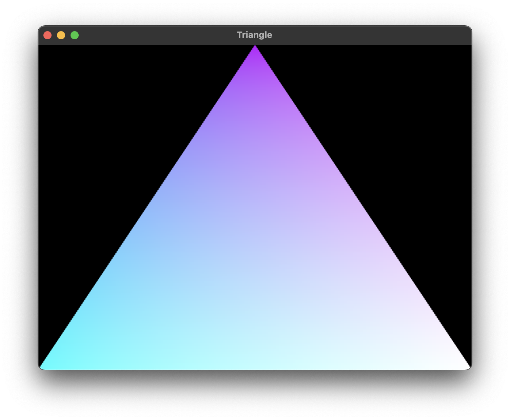

# Getting Started

Please see the platform-specific guides below:
  - [Apple macOS](#apple-macos)
  - [Microsoft Windows](#microsoft-windows)
  - [Ubuntu Linux](#ubuntu-linux)

## Apple macOS

These instructions are only a suggestion. Other setup options are possible.
These instructions were tested manually in a fresh Virtual Machine installation
of macOS Big Sur (11.5.2) on 2021-08-21.

### Toolchain Installation

  1. Install the
     [Rust toolchain](https://www.rust-lang.org/tools/install) using `rustup`.
     
  1. Install the [Haskell toolchain](https://www.haskell.org/ghcup/) using
     `ghcup`. You may need to run the install command twice, the second time
     after being prompted to install the XCode command line tools. Instructions
     will be displayed in the terminal. You may need to use `ghcup tui` to
     select an appropriate GHC version (GHC 8.10.7) and Cabal version (Cabal 3.4). 

  1. Install the [Homebrew](https://brew.sh/) package manager.

  1. Install SDL2 via Homebrew. In a terminal:

     ```sh
     brew install sdl2 
     ```
     
### Build and Run an Example

  1. Clone the repository. In a terminal:
  
     ```sh
     git clone https://github.com/lancelet/wgpu-hs.git
     cd wgpu-hs
     git submodule update --init --recursive
     ```
     
  1. Build the Rust library `libwgpu_native.dylib`:
  
     ```sh
     pushd wgpu-raw-hs-codegen/wgpu-native
     WGPU_NATIVE_VERSION='v0.9.2.2' make lib-native
     popd
     ```
     
  1. Set `LD_LIBRARY_PATH` to include the Rust dynamic library that was just
     built:
     
     ```sh
     export LD_LIBRARY_PATH=$(pwd)/wgpu-raw-hs-codegen/wgpu-native/target/debug/:$LD_LIBRARY_PATH
     ```
     
  1. Build and run the `triangle` example:
  
     ```sh
     cabal run triangle
     ```

### Potential Fixes (tested on an M3 MacBook Pro)

  1. Install the correct LLVM version

      If you face the following error during the build-process:

      ```sh
      <no location info>: error:
          Warning: Couldn't figure out LLVM version!
                   Make sure you have installed LLVM between [9 and 13)
      ghc: could not execute: opt
      cabal: Failed to build wgpu-raw-hs-0.4.0.0 (which is required by
      exe:triangle-glfw from wgpu-hs-0.4.0.0).
      ```

      You need to make sure the correct LLVM version is installed. It can be installed with:

      ```sh
      brew install llvm@12
      # make sure to add it to your path:
      export PATH=$PATH:/opt/homebrew/opt/llvm@12/bin/
      ```

  1. Add the Dylib to correct path:

        If you are still getting a linking error, try adding it to `DYLD_LIBRARY_PATH` instead of `LD_LIBRARY_PATH`:

        ```sh
        export DYLD_LIBRARY_PATH=$(pwd)/wgpu-raw-hs-codegen/wgpu-native/target/debug/:$DYLD_LIBRARY_PATH
        ```



## Microsoft Windows

These instructions are only a suggestion. Other setup options are possible.
These instructions were tested manually in a fresh Virtual Machine installation
of Windows 10 on 2021-08-21.

### Toolchain Installation

  1. Install the 
     [Microsoft C++ Build Tools](https://visualstudio.microsoft.com/visual-cpp-build-tools/).
     Select the "Desktop development with C++" option as a minimum.

  1. Install the [Rust toolchain](https://www.rust-lang.org/tools/install) using
     `rustup` (ie. `RUSTUP-INIT.EXE` - 64 bit).

  1. Install the [Haskell toolchain](https://www.haskell.org/ghcup/) using
     `ghcup`. `HLS` and `Stack` are optional installations, but make sure to
     install `MSys2`. You may need to use `ghcup tui` to select an appropriate
     GHC version (GHC 8.10.7) and Cabal version (Cabal 3.4). 
     
  1. Install the [Chocolatey](https://chocolatey.org/) package manager.

  1. Install the required Chocolatey packages. In an Administrator PowerShell:
  
     ```powershell
     choco install git make llvm -y
     ```
  1. (For SDL2 only.) Install SDL2 for development.
 
### Build and Run an Example

  1. Clone the repository. In PowerShell:
  
     ```powershell
     git clone https://github.com/lancelet/wgpu-hs.git
     cd wgpu-hs
     git submodule update --init --recursive
     ```

  1. Build the Rust library `wgpu-native.dll`:
  
     ```powershell
     pushd wgpu-raw-hs-codegen/wgpu-native
     set WGPU_NATIVE_VERSION='v0.9.2.2'
     make lib-native
     popd
     ```

  1. Copy the DLL file so that it can be found when running the example:
  
     ```powershell
     cp wgpu-raw-hs-codegen/wgpu-native/target/debug/wgpu_native.dll wgpu_native.dll 
     ```
     
  1. Build and run the `triangle` example:
  
     ```powershell
     cabal run triangle 
     ```

## Ubuntu Linux

These instructions are only a suggestion. Other setup options are possible.
These instructions were tested manually in a fresh installation of Ubuntu Linux
20.04.3 LTS on 2021-08-24.

### Toolchain Installation

  1. Make sure your Linux graphics drivers are up-to-date, and that they
     support Vulkan.
     
  1. Install the required development tools supplied in the Ubuntu
     repositories:
     
     ```sh
     sudo apt-get update
     sudo apt-get install \
       build-essential \
       clang \
       curl \
       git \
       libffi-dev \
       libffi7 \
       libgmp-dev \
       libncurses-dev \
       libncurses5 \
       libtinfo5 \
       libglfw3-dev \
       libsdl2-dev \
       libxi-dev \
       libxxf86vm-dev \
       libxcursor-dev \
       libxinerama-dev \
       -y
     ```
     
     (NB: `libglfw3-dev` will als bring in `libvulkan-dev`.)
     
  1. Install the
     [Rust toolchain](https://www.rust-lang.org/tools/install) using `rustup`.

  1. Install the [Haskell toolchain](https://www.haskell.org/ghcup/) using
     `ghcup`. You may need to use `ghcup tui` to select an appropriate GHC
     version (GHC 8.10.7) and Cabal version (Cabal 3.4). 

### Build and Run an Example

  1. Clone the repository. In a terminal:
  
     ```sh
     git clone https://github.com/lancelet/wgpu-hs.git
     cd wgpu-hs
     git submodule update --init --recursive
     ```
     
  1. Build the Rust library `libwgpu_native.so`:
  
     ```sh
     pushd wgpu-raw-hs-codegen/wgpu-native
     WGPU_NATIVE_VERSION='v0.9.2.2' make lib-native
     popd
     ```
     
  1. Set `LD_LIBRARY_PATH` to include the Rust dynamic library that was just
     built:
     
     ```sh
     export LD_LIBRARY_PATH=$(pwd)/wgpu-raw-hs-codegen/wgpu-native/target/debug/:$LD_LIBRARY_PATH
     ```
     
  1. Build and run the `triangle` example:
  
     ```sh
     cabal run triangle
     ```
